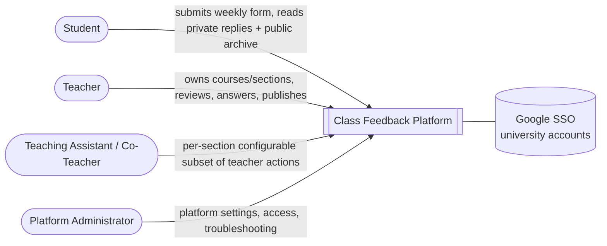
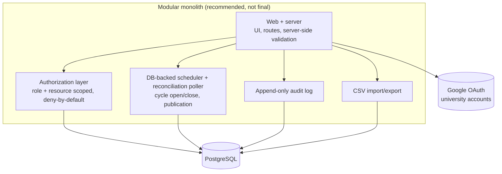
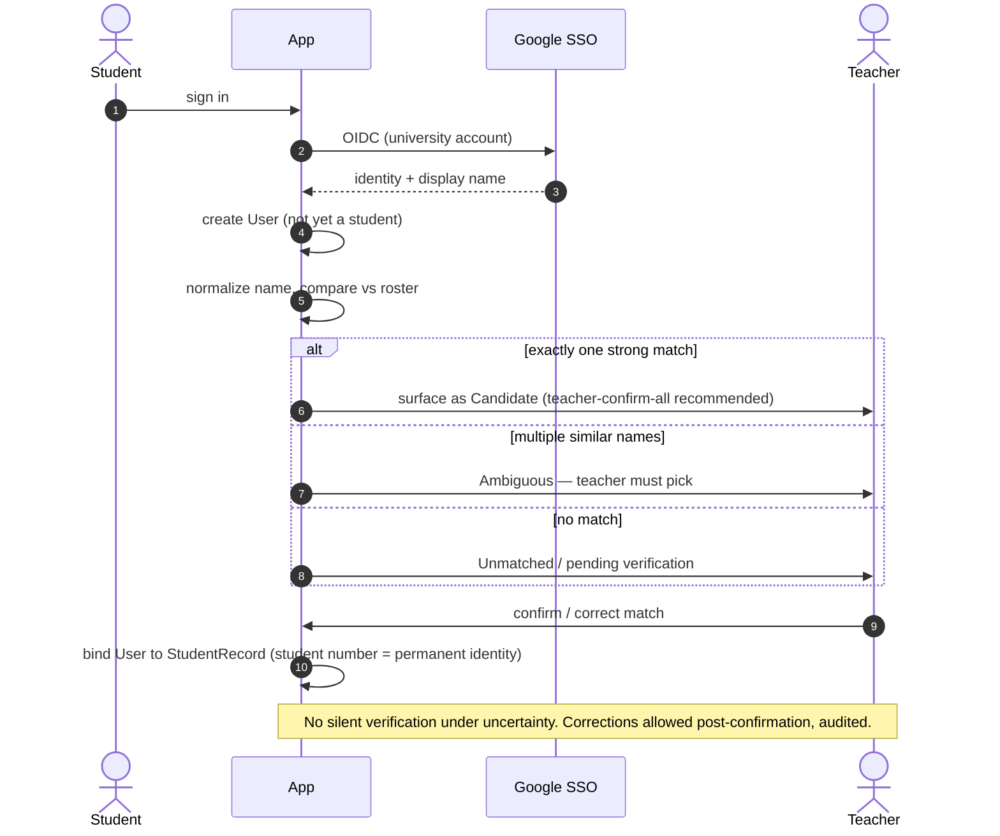
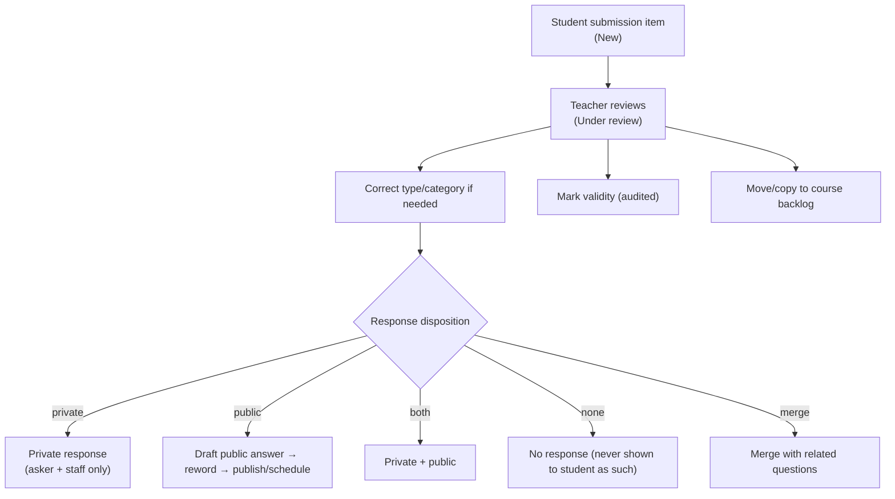
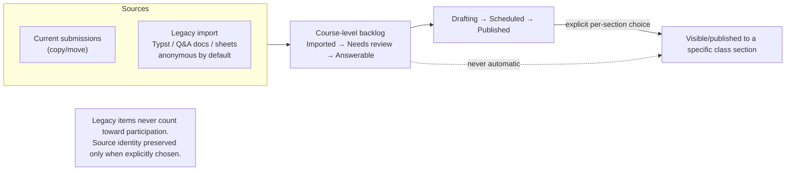
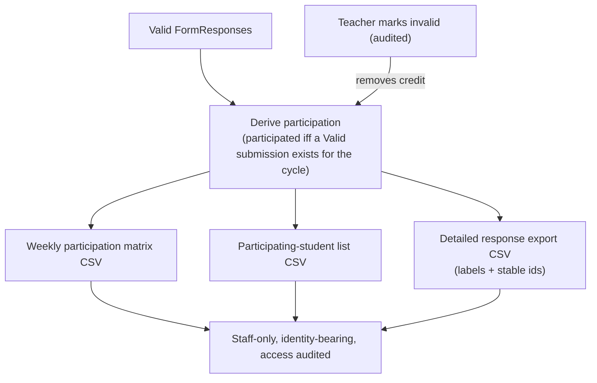
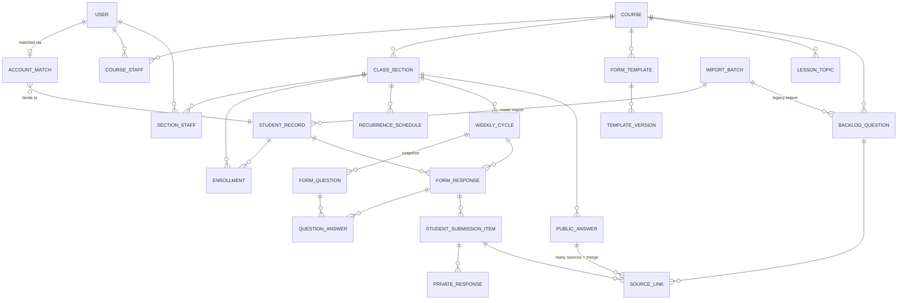

# AGENTS.md — Class Feedback Platform

High-level guide for humans and AI coding agents working in this repository.

> **Repository phase: implementation started (owner-approved).** The owner has explicitly requested the MVP foundation implementation; application code now lives under `src/` (see [README.md](README.md)). Further implementation work remains allowed **only** within owner-approved implementation prompts and the MVP scope in [docs/mvp-scope.md](docs/mvp-scope.md). See [§13 Rules for future coding agents](#13-rules-for-future-coding-agents).
>
> **Label discipline:** across all docs, statements are tagged **[Confirmed]** (owner-stated), **[Recommended]** (proposed, not approved), **[Assumption]** (inferred), or **[Open]** (unresolved — see [docs/open-decisions.md](docs/open-decisions.md)). Recommendations are **never** treated as approved requirements.

---

## 1. What is this app?

A centralized web platform for **recurring weekly class feedback** that replaces a Google Forms + manually-compiled answer-document workflow.

Each **class section** runs a recurring **weekly feedback form**. Students submit **one form per section per week**. Teachers review the responses, answer students **privately**, publish **anonymized** Q&A entries **publicly** to the class, track **weekly participation**, reuse **templates**, and manage a **course-level question backlog** that also absorbs **legacy questions** imported from old documents and spreadsheets.

**Product thesis:** collection was never the problem — the old Google Forms flow collected fine. The pain was *everything after collection*: reviewing, answering, publishing anonymized answers, tracking participation, reusing templates, searching past Q&A, and preserving the link between a published answer and the original student submission. This platform owns that after-collection workflow.

Full goals and background: [docs/product-requirements.md](docs/product-requirements.md).

### 1.1 The concepts this app is built around

| Concept | Meaning |
|---|---|
| **Course** | A reusable academic course; owns templates, lessons/topics, the question backlog, and multiple sections. |
| **Class Section** | A specific offering of a course; owns its own students, staff, schedule, cycles, responses, participation, and public Q&A archive. |
| **Weekly feedback cycle** | One weekly instance of a section's feedback form. |
| **Recurring weekly form schedule** | Per-section config that auto-generates and auto-opens cycles (schedule-driven — **not** AI-generated content). |
| **Teacher-created form questions** | Structured questions (Google Forms-style types) snapshotted into each cycle. |
| **Student-originated question/feedback section** | Always-present part of every form where a student submits their own question / feedback / concern / clarification / suggestion. |
| **Private teacher responses** | Reply visible only to the asking student and authorized staff. |
| **Public anonymous Q&A archive** | Per-section searchable archive of published questions + answers, with the asker anonymous. |
| **Source link** | Internal link tying a published public answer back to its original student submission(s) — never exposed to other students. |
| **Course-level question backlog** | Course-scoped pool of answerable-later questions, separate from the weekly dashboard. |
| **Legacy question import** | Historical questions brought in from old Typst files, Q&A docs, and spreadsheets — anonymous by default. |
| **Weekly participation tracking** | Derived from valid weekly submissions; exported as CSV for staff. |

---

## 2. Non-goals for the current phase

The current phase is **planning/documentation only**. In this phase:

- **No** application code, framework scaffolding, or UI.
- **No** dependencies, package manifests, migrations, or database setup.
- **No** authentication, AI, or test code.
- **No** promotion of a recommendation into a confirmed requirement.

Product-level non-goals (MVP scope) are authoritative in [docs/mvp-scope.md](docs/mvp-scope.md). Notably out of MVP: student file attachments, editing submitted forms, comments/threads/voting, native mobile apps, PDF/Word exports, public access for unenrolled users, microservices, dedicated AI infrastructure. **Course-material management** and **unpublishing** are **not** MVP. **All AI is post-MVP.**

---

## 3. Actors



| Actor | What they do |
|---|---|
| **Student** | Signs in with an authorized university Google account; completes the weekly form per section; answers teacher questions; submits their own question/feedback; views their history, private replies, and whether their question was publicly answered; searches the class's anonymous Q&A archive. Cannot see other students' identities, validity decisions, drafts, notes, audit, or (MVP) participation totals. |
| **Teacher** | Administers the courses/sections they own. Manages courses, sections, rosters, staff, TA permissions, schedules, templates, and questions; confirms/corrects account matches; reviews responses; marks validity; sends private responses; drafts/rewords/publishes/schedules public answers; merges questions; manages the backlog and legacy imports; exports participation; views audit history. |
| **Teaching Assistant / Co-Teacher** | Holds a **per-section, configurable** subset of teacher capabilities (view identities, review, respond, draft/reword/publish/schedule, mark validity, export, manage cycles/templates/backlog). The class owner controls these flags. |
| **Platform Administrator** | Selected accounts only. Platform-wide settings, user-access issues, account/system troubleshooting, platform-level audit access. Gains **no** automatic content access to arbitrary courses/sections. |

Full role definitions, the TA permission catalog, and the permission→action matrix: [docs/roles-and-permissions.md](docs/roles-and-permissions.md).

---

## 4. Key concepts (rules that shape everything)

- **Three academic levels:** Course → Class Section → Weekly Cycle. Templates, backlog, lessons/topics, and (future) course materials live at the **course** level; students, staff, schedules, cycles, responses, participation, and the public archive live at the **section** level.
- **Schedule-driven cycles.** A per-section recurring schedule (frequency, open day/time, deadline, start, end/occurrences, template) generates cycles that **auto-open** on time. Generation and open/close are **idempotent** with a **reconciliation poller** backstop.
- **One submission per student per section per cycle**, enforced by a uniqueness constraint. No edits after submit; no late submission.
- **Templates snapshot on apply.** Applying a template copies its questions into the cycle; later template edits create new versions and never mutate already-generated cycles.
- **Original student wording is immutable.** Teachers may reword the *public* version; the original is never overwritten.
- **Public answers are anonymous** to other students but stay **internally source-linked** to the original submission(s), including when multiple submissions are **merged** into one answer.
- **Participation is derived**, not a mutable counter: a student participated in a cycle iff a `Valid` submission exists for that `(cycle, student)`.
- **Anonymous-by-default legacy import.** Imported historical questions are anonymous unless a teacher explicitly preserves source identity; legacy items never count toward participation.

---

## 5. System architecture at a glance

Conceptual only. The stack is a **recommendation pending owner approval** and is **gated by the "Fable" clarification** ([Open D1](docs/open-decisions.md) — is "Fable" the Claude Fable tooling, or a desired F#/Fable implementation stack?). **Do not treat the stack as final.**



Recommended direction **[Recommended, pending approval + Open D1]**: a **modular monolith** on **PostgreSQL**, **Google OAuth**, **role/resource-based authorization**, **database-backed scheduling** (no message broker), **CSV import/export**, **audit logging**, **Docker-based development**, and **automated testing**. Explicitly avoided: microservices, message brokers, separate databases, event-driven infra, dedicated vector DBs, standalone AI services.

The concrete TypeScript stack (Next.js + Drizzle + Auth.js + pg-boss + Zod) is a recommendation only — see [docs/architecture-proposal.md](docs/architecture-proposal.md). Module boundaries: identity & matching · catalog · forms · review & publishing · backlog & import · participation & export · audit.

---

## 6. Core workflows

These diagrams convey the **product**, not an implementation contract.

### 6.1 Student account matching after Google SSO

The highest-risk flow: the roster CSV has only student number + full name (no email), so matching relies on name comparison. See [docs/account-matching.md](docs/account-matching.md).



### 6.2 Weekly cycle generation and submission

```mermaid
sequenceDiagram
  autonumber
  participant Sched as Scheduler
  participant App
  actor Student

  Sched->>App: generate cycles from recurrence (idempotent; snapshot template version)
  Sched->>App: at open-at → cycle OPEN (reconciled if scheduler was down)
  Student->>App: open current form
  Student->>App: answer teacher questions + optional student-originated item
  App->>App: server-side validation (required questions)
  App->>App: create FormResponse — unique (cycle, student); state Submitted; validity Valid
  App-->>Student: "Submitted" (no edits allowed; no late submission)
  Sched->>App: at deadline → cycle CLOSED
```

### 6.3 Teacher review + private/public response



### 6.4 Public Q&A publishing with source linking

```mermaid
sequenceDiagram
  autonumber
  actor Teacher
  participant App
  actor Student
  actor Class

  Teacher->>App: reword public question (original preserved, immutable)
  App->>App: pre-publish anonymity warning if question is highly specific/personal
  Teacher->>App: publish now OR schedule (institution timezone)
  App->>App: create PublicAnswer + SourceLink(s) (internal only)
  Note over App: Scheduled publication is idempotent; reconciliation catches missed jobs; failures surface in-app.
  App-->>Class: anonymous public entry in section archive
  App-->>Student: "Answered" + reworded text + answer, via their own history
  Note over App,Class: Merge = many SourceLinks → one answer; no source identity revealed; must not imply a single asker unless safe.
```

### 6.5 Course-level backlog & legacy question flow



### 6.6 Participation tracking / export



Details: [docs/weekly-form-workflow.md](docs/weekly-form-workflow.md), [docs/public-qa-and-source-linking.md](docs/public-qa-and-source-linking.md), [docs/question-backlog.md](docs/question-backlog.md), [docs/legacy-question-import.md](docs/legacy-question-import.md), [docs/participation-rules.md](docs/participation-rules.md).

---

## 7. State models

**Design principle: avoid one giant status field.** Each concern is an **independent dimension** (a form response, for example, carries *both* a review state and a validity state, which change independently). Full transition tables, invalid combinations, and student-visible projections: [docs/domain-model.md](docs/domain-model.md#3-state-models).

| Dimension | States |
|---|---|
| **Weekly cycle** | Draft · Scheduled · Open · Closed · Archived · Skipped |
| **Form response** | Submitted · Under review · Reviewed · Archived |
| **Participation validity** | Valid · Invalid |
| **Student-question review** | New · Under review · Resolved · Archived · Moved to backlog |
| **Response disposition** | Undecided · Private · Public · Private+Public · No response · Merged |
| **Public-answer** | No draft · Draft · Scheduled · Published · *(Unpublished — future only, [Open D6](docs/open-decisions.md))* |
| **Backlog question** | Imported · Needs review · Answerable · Drafting · Scheduled · Published · Archived · Not suitable |
| **Account match** | Unmatched · Candidate · Ambiguous · Confirmed · Rejected · Correction-pending |

---

## 8. Data model summary

Conceptual entities only — **no SQL, no migrations.** Full field lists and relationships: [docs/domain-model.md](docs/domain-model.md).



Core entities: **User · StudentRecord · AccountMatch · Course · CourseStaff · ClassSection · SectionStaff · Enrollment · RecurrenceSchedule · WeeklyCycle · FormTemplate · TemplateVersion · FormQuestion · FormResponse · QuestionAnswer · StudentSubmissionItem · PrivateResponse · PublicAnswer · SourceLink · BacklogQuestion · ImportBatch · Lesson/Topic · AuditEvent.**

`CourseMaterial` is reserved for the future (post-MVP) — the model stays compatible via course-level ownership and topic tags, but material management is not built in MVP. Participation is **derived** from valid `FormResponse`s, not a stored entity.

---

## 9. Privacy, security, and audit rules

These are invariants. Treat them as hard constraints when implementation eventually begins. Full risk register: [docs/product-requirements.md](docs/product-requirements.md#7-security--privacy-risk-register).

- **Students must not see other students' identities.**
- **Public Q&A is anonymous to students** — the asker is never revealed or safely implied.
- **Original student wording is never overwritten** — rewording produces public text alongside the immutable original.
- **Public reworded questions stay internally source-linked** to their originating submission(s) so the asker sees "Answered" without exposing identity to others.
- **Name-based account matching is risky and must not silently verify uncertain matches** — matching yields candidates only; teacher confirmation is required for ambiguity (teacher-confirm-all recommended for MVP).
- **Small-class anonymity failure is a real risk** — a single asker or a highly specific/personal question can remain identifiable; rewording must strip identifying context and the publish UI warns before publishing such questions.
- **Identity-bearing exports are staff-only** and access is audited.
- **Authorization is deny-by-default and resource-scoped** — teachers get no access to unrelated courses/sections/students.
- **Students never see** validity/invalidation, no-response decisions, drafts, internal notes, audit records, or (MVP) participation totals.
- **Audit logs are required** for important actions (actor, action, timestamp, affected entity, before/after values).
- **AI is post-MVP** and must **never** receive student PII or automatically send/publish anything; a human approves all AI output. See [docs/ai-future-plan.md](docs/ai-future-plan.md).

---

## 10. Documentation map

Read the first three, then by area. Each concept has a single owning document; others link rather than restate.

1. [docs/product-requirements.md](docs/product-requirements.md) — master requirements, assumptions, risk register.
2. [docs/mvp-scope.md](docs/mvp-scope.md) — MVP / post-MVP / out-of-scope boundary.
3. [docs/domain-model.md](docs/domain-model.md) — entities, relationships, **all state models**, audit shape.
4. [docs/roles-and-permissions.md](docs/roles-and-permissions.md) — roles, authorization model, TA permission catalog.
5. [docs/weekly-form-workflow.md](docs/weekly-form-workflow.md) — recurrence, cycle generation/auto-open, form/question schema, templates, submission.
6. [docs/participation-rules.md](docs/participation-rules.md) — validity, derivation, CSV exports.
7. [docs/account-matching.md](docs/account-matching.md) — SSO, name matching, roster import.
8. [docs/public-qa-and-source-linking.md](docs/public-qa-and-source-linking.md) — private/public responses, rewording, source links, anonymity, scheduling, archive, student history.
9. [docs/question-backlog.md](docs/question-backlog.md) — course-level backlog.
10. [docs/legacy-question-import.md](docs/legacy-question-import.md) — legacy import, anonymous-by-default.
11. [docs/ai-future-plan.md](docs/ai-future-plan.md) — post-MVP AI direction and constraints.
12. [docs/architecture-proposal.md](docs/architecture-proposal.md) — recommended (not approved) stack and design.
13. [docs/open-decisions.md](docs/open-decisions.md) — **read before implementing.**

---

## 11. Deferred and open decisions

The stack and several product rules are unresolved. The full list (question · options · trade-offs · recommendation · wait-for-approval) is in [docs/open-decisions.md](docs/open-decisions.md). The load-bearing ones:

- **D1 — "Fable" meaning.** Claude Fable tooling vs an F#/Fable implementation stack. **Gates the entire stack.** TypeScript is presented as the current recommendation only.
- **D2 — account-match auto-confirm policy.** Teacher-confirm-all (recommended) vs exact-unique auto-confirm. Highest-risk flow.
- **D6 — unpublish support** (post-MVP; `Unpublished` state reserved only).
- **D7 — timezone** (institution-wide value needed).
- Others: teacher-role granting, edit-lock after first submission, grace/reopen, merge scope, join-code extra factor, deactivated-student access, ORM choice, deployment target, data retention.

Deferred features (post-MVP): notifications, all AI features, course-material management, student-facing participation totals, advanced analytics, LMS integration, automated legacy-file parsing. See [docs/mvp-scope.md](docs/mvp-scope.md).

---

## 12. Where to go from here

- **Understand the product:** start at [docs/product-requirements.md](docs/product-requirements.md) and [docs/mvp-scope.md](docs/mvp-scope.md).
- **Understand the model:** [docs/domain-model.md](docs/domain-model.md) (entities + state) and [docs/roles-and-permissions.md](docs/roles-and-permissions.md).
- **Before any implementation:** read [docs/open-decisions.md](docs/open-decisions.md) and get owner sign-off on D1 (stack/"Fable"), D2 (matching), and D7 (timezone) first.
- **When implementation is approved:** [docs/architecture-proposal.md](docs/architecture-proposal.md) proposes module boundaries, scheduling, authorization, audit, and CSV design to build from — none of it is code yet.

---

## 13. Rules for future coding agents

- **This repo is currently documentation-only.**
- **Do not implement code** unless explicitly requested.
- **Do not initialize frameworks** unless explicitly requested.
- **Do not add dependencies** unless explicitly requested.
- **Do not create migrations or database setup** unless explicitly requested.
- **Do not silently promote recommendations into confirmed requirements** — keep the [Confirmed]/[Recommended]/[Assumption]/[Open] labels intact.
- **Always check [docs/open-decisions.md](docs/open-decisions.md) before implementation work.** If a relevant decision is marked "wait for owner approval," stop and surface it rather than guessing.
- **Preserve MVP / post-MVP / out-of-scope boundaries** ([docs/mvp-scope.md](docs/mvp-scope.md)); do not pull deferred items into MVP on your own.
- **Prefer small, reviewable changes.**
- **Keep docs cross-linked** — one owning doc per concept; link instead of duplicating.
- **When unsure, document the uncertainty** as an open decision instead of inventing a business rule.
