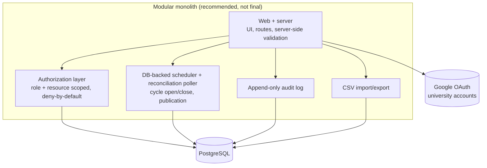
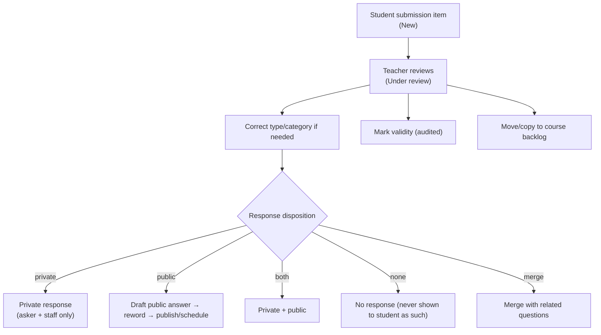
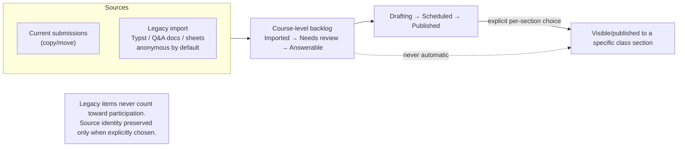
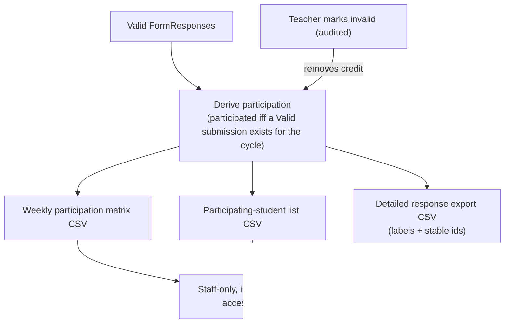
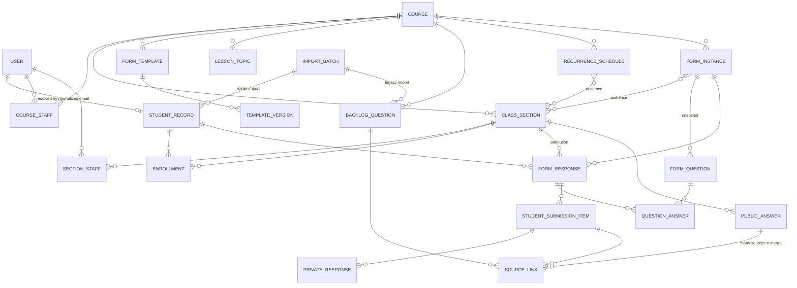

# AGENTS.md — Class Feedback Platform

High-level guide for humans and AI coding agents working in this repository.

> **Repository phase: full-scope implementation (owner-approved 2026-08-03).**
> [docs/project-specs.md](docs/project-specs.md) is the acceptance target for Epics A–F plus the
> post-pilot stories `P1` (legacy import) and `P2` (reactions and moderated comments). Application
> code lives under `src/` (see [README.md](README.md)). Where an older document conflicted with
> `project-specs.md`, `project-specs.md` wins and the owning document has been corrected — see the
> scope-expansion table in [docs/mvp-scope.md](docs/mvp-scope.md) and the resolved-decision table in
> [docs/open-decisions.md](docs/open-decisions.md). See [§13 Rules for future coding agents](#13-rules-for-future-coding-agents).
>
> **Label discipline:** across all docs, statements are tagged **[Confirmed]** (owner-stated), **[Recommended]** (proposed, not approved), **[Assumption]** (inferred), or **[Open]** (unresolved — see [docs/open-decisions.md](docs/open-decisions.md)). Recommendations are **never** treated as approved requirements.

---

## 1. What is this app?

A centralized web platform for **recurring weekly class feedback** that replaces a Google Forms + manually-compiled answer-document workflow.

Each **class section** runs a recurring **weekly feedback form**. Students submit **one form per section per week**. Teachers review the responses, answer students **privately**, publish **anonymized** Q&A entries **publicly** to the class, track **weekly participation**, reuse **templates**, and manage a **course-level question backlog** that also absorbs **legacy questions** imported from old documents and spreadsheets.

**Product thesis:** collection was never the problem — the old Google Forms flow collected fine. The pain was *everything after collection*: reviewing, answering, publishing anonymized answers, tracking participation, reusing templates, searching past Q&A, and preserving the link between a published answer and the original student submission. This platform owns that after-collection workflow.

Full goals and background: [docs/product-requirements.md](docs/product-requirements.md).

### 1.1 The concepts this app is built around

| Concept | Meaning |
|---|---|
| **Course** | The primary workspace, identified by its **course code** (`CS 33`). Owns forms, lessons/topics, the question backlog, bonus periods, and its class sections. |
| **Class Section** | A class list of a course: the access/audience context. Owns its students (identified by their UP email), staff and TA permissions, participation exports, and public Q&A archive. It is **not** the primary object in the form workflow. |
| **Form definition** | A reusable form belonging to a course: title, optional purpose, and immutable versions of its questions. `weekly` is **not** part of its identity. |
| **Form audience** | The explicit set of sections that receive a form — all sections of the course, several, or one. Auditable rows, never inferred. |
| **Form instance** | The questionnaire students actually answer: its own audience, window, state, and question snapshot. One per delivery occurrence. |
| **Delivery mode** | `One time` · `Every week` · `Custom schedule` · `Open manually`. Schedule-driven — **not** AI-generated content. |
| **Teacher-created form questions** | Structured questions (Google Forms-style types) snapshotted into each form instance, and editable **for one occurrence only**. |
| **Student-originated question/feedback section** | Always-present part of every form where a student submits their own question / feedback / concern / clarification / suggestion. |
| **Private teacher responses** | Reply visible only to the asking student and authorized staff. |
| **Public anonymous Q&A archive** | Per-section searchable archive of published questions + answers, with the asker anonymous. |
| **Source link** | Internal link tying a published public answer back to its original student submission(s) — never exposed to other students. |
| **Course-level question backlog** | Course-scoped pool of answerable-later questions, separate from the weekly dashboard. |
| **Legacy question import** | Historical questions brought in from old Typst files, Q&A docs, and spreadsheets — anonymous by default. |
| **Weekly participation tracking** | Derived from valid weekly submissions; exported as CSV for staff. |

---

## 2. Non-goals for the current phase

The repository is **past** the documentation-only phase: the application is implemented under
`src/`, and on 2026-08-03 the owner approved [docs/project-specs.md](docs/project-specs.md) as the
acceptance target for the full Epic A–F scope plus post-pilot stories `P1` and `P2`.

Product-level scope is authoritative in [docs/mvp-scope.md](docs/mvp-scope.md), which now records
that expansion. Still out of scope: student file attachments, question voting, public student
identities, native mobile apps, Word exports, public access for unenrolled users, microservices,
course-material management, and dedicated AI infrastructure. **All AI (`P3`) remains parked.**

---

## 3. Actors


| Actor | What they do |
|---|---|
| **Student** | Signs in with an authorized university Google account; completes the weekly form per section; answers teacher questions; submits their own question/feedback; views their history, private replies, and whether their question was publicly answered; searches the class's anonymous Q&A archive. Cannot see other students' identities, validity decisions, drafts, notes, audit, or (MVP) participation totals. |
| **Teacher** | Administers the courses/sections they own. Manages courses, sections, rosters, staff, TA permissions, schedules, templates, and questions; reviews responses; marks validity; sends private responses; drafts/rewords/publishes/schedules public answers; merges questions; manages the backlog and legacy imports; exports participation; views audit history. |
| **Teaching Assistant / Co-Teacher** | Holds a **per-section, configurable** subset of teacher capabilities (view identities, review, respond, draft/reword/publish/schedule, mark validity, export, manage cycles/templates/backlog). The class owner controls these flags. |
| **Platform Administrator** | Selected accounts only. Platform-wide settings, user-access issues, account/system troubleshooting, platform-level audit access. Gains **no** automatic content access to arbitrary courses/sections. |

Full role definitions, the TA permission catalog, and the permission→action matrix: [docs/roles-and-permissions.md](docs/roles-and-permissions.md).

---

## 4. Key concepts (rules that shape everything)

- **The course owns forms; the section is who receives them.** Forms, backlog, lessons/topics, bonus periods, and (future) course materials live at the **course** level; students, staff, participation exports, and the public archive live at the **section** level. A form's **audience** is an explicit set of sections. See [docs/FORMS-AUDIENCE-DYNAMIC-INSTANCES.md](docs/FORMS-AUDIENCE-DYNAMIC-INSTANCES.md).
- **Four delivery modes, of which weekly is one.** A delivery configuration (mode, audience, window controls, source form version) generates instances that **auto-open** on time — except `Open manually`, which only a person opens. Generation and open/close are **idempotent** with a **reconciliation poller** backstop.
- **One submission per student per form instance**, enforced by a uniqueness constraint on `(instance, student record)`. The section a response is attributed to is recorded separately and is deliberately **not** in that key, so a student in two targeted sections cannot produce two responses. A student may save a draft and **edit that same response until the deadline**; at the deadline the latest submitted version locks. No late submission, no late edit. An edit never mints a second participation credit.
- **Forms snapshot on generate.** Generating an instance copies the form's questions into it; later edits to the form create a new version and never mutate an already-generated instance. **One occurrence's questions can be varied on their own** — the base form and every other occurrence are untouched.
- **A shared form never widens visibility.** Staff see only the audience sections they hold the permission on; a published answer goes to the **asker's own** section only.
- **Original student wording is immutable.** Teachers may reword the *public* version; the original is never overwritten.
- **Public answers are anonymous** to other students but stay **internally source-linked** to the original submission(s), including when multiple submissions are **merged** into one answer.
- **Participation is derived**, not a mutable counter: a student participated in a cycle iff a submitted (non-draft) response exists for that `(cycle, student)` whose validity is not `Invalid`. Credit rolls up into **course-scoped bonus periods**, one credit per cycle at most.
- **Anonymous-by-default legacy import.** Imported historical questions are anonymous unless a teacher explicitly preserves source identity; legacy items never count toward participation.

---

## 5. System architecture at a glance

Conceptual only. The stack is a **recommendation pending owner approval** and is **gated by the "Fable" clarification** ([Open D1](docs/open-decisions.md) — is "Fable" the Claude Fable tooling, or a desired F#/Fable implementation stack?). **Do not treat the stack as final.**



Recommended direction **[Recommended, pending approval + Open D1]**: a **modular monolith** on **PostgreSQL**, **Google OAuth**, **role/resource-based authorization**, **database-backed scheduling** (no message broker), **CSV import/export**, **audit logging**, **Docker-based development**, and **automated testing**. Explicitly avoided: microservices, message brokers, separate databases, event-driven infra, dedicated vector DBs, standalone AI services.

The concrete TypeScript stack (Next.js + Drizzle + Auth.js + pg-boss + Zod) is a recommendation only — see [docs/architecture-proposal.md](docs/architecture-proposal.md). Module boundaries: identity & matching · catalog · forms · review & publishing · backlog & import · participation & export · audit.

---

## 6. Core workflows

These diagrams convey the **product**, not an implementation contract.

### 6.1 Student access after Google SSO

**[Confirmed 2026-08-07]** The class list carries the student's **UP email**, and that email —
normalized and compared with exact equality — is the only thing that makes an account a student.
No name similarity, no student-number claim, no manual confirmation. See
[docs/student-identity.md](docs/student-identity.md).

```mermaid
sequenceDiagram
  autonumber
  actor Teacher
  participant App
  actor Student
  participant Google as Google SSO

  Teacher->>App: import class list (student number, full name, UP email)
  App->>App: normalize + validate each email; refuse missing/malformed/off-domain/duplicate/taken rows
  App->>App: store roster_email on the StudentRecord (unique) - THIS is the access grant
  Student->>App: sign in
  App->>Google: OIDC (university account)
  Google-->>App: identity
  App->>App: normalize email, create/update User
  App->>App: roster_email = user email? then active enrollments, then sections
  alt on a class list
    App-->>Student: their forms, immediately
  else on no class list
    App-->>Student: "No classes are associated with this UP email yet."
  end
  Note over App,Student: Order does not matter - a roster imported after the account already existed grants access on the next request, with no second login.
```

### 6.2 Form-instance generation and submission

```mermaid
sequenceDiagram
  autonumber
  participant Sched as Scheduler
  participant App
  actor Student

  Sched->>App: generate instances from the delivery configuration<br/>(idempotent; copy audience; snapshot form version)
  Sched->>App: at open-at → instance OPEN (reconciled if scheduler was down)
  Student->>App: open the form (reached through its audience, not a section)
  Student->>App: answer teacher questions + optional student-originated item
  App->>App: server-side validation (required questions)
  App->>App: create FormResponse — unique (instance, student), attribution section resolved;<br/>state Submitted; validity Valid
  App-->>Student: "Submitted" (editable until the deadline; no late submission)
  Sched->>App: at deadline → instance CLOSED, responses locked
```

### 6.3 Teacher review + private/public response



### 6.4 Public Q&A publishing with source linking

```mermaid
sequenceDiagram
  autonumber
  actor Teacher
  participant App
  actor Student
  actor Class

  Teacher->>App: reword public question (original preserved, immutable)
  App->>App: pre-publish anonymity warning if question is highly specific/personal
  Teacher->>App: publish now OR schedule (institution timezone)
  App->>App: create PublicAnswer + SourceLink(s) (internal only)
  Note over App: Scheduled publication is idempotent; reconciliation catches missed jobs; failures surface in-app.
  App-->>Class: anonymous public entry in section archive
  App-->>Student: "Answered" + reworded text + answer, via their own history
  Note over App,Class: Merge = many SourceLinks → one answer; no source identity revealed; must not imply a single asker unless safe.
```

### 6.5 Course-level backlog & legacy question flow



### 6.6 Participation tracking / export



Details: [docs/weekly-form-workflow.md](docs/weekly-form-workflow.md), [docs/public-qa-and-source-linking.md](docs/public-qa-and-source-linking.md), [docs/question-backlog.md](docs/question-backlog.md), [docs/legacy-question-import.md](docs/legacy-question-import.md), [docs/participation-rules.md](docs/participation-rules.md).

---

## 7. State models

**Design principle: avoid one giant status field.** Each concern is an **independent dimension** (a form response, for example, carries *both* a review state and a validity state, which change independently). Full transition tables, invalid combinations, and student-visible projections: [docs/domain-model.md](docs/domain-model.md#3-state-models).

| Dimension | States |
|---|---|
| **Form instance** | Draft · Scheduled · Open · Closed · Archived · Skipped |
| **Response lifecycle** | Draft · Submitted · Locked |
| **Form response review** | Submitted · Under review · Reviewed · Archived |
| **Participation validity** | Valid · Flagged · Invalid |
| **Student-question review** | New · Under review · Resolved · Archived · Moved to backlog |
| **Response disposition** | Undecided · Private · Public · Private+Public · No response · Merged |
| **Public-answer** | No draft · Draft · Awaiting approval · Scheduled · Published · Unpublished |
| **Backlog confirmation** | Recommended · Confirmed · Rejected · Removal recommended · Removed |
| **Comment moderation** | Pending · Approved · Rejected · Removed |
| **Backlog question** | Imported · Needs review · Answerable · Drafting · Scheduled · Published · Archived · Not suitable |

---

## 8. Data model summary

Conceptual entities only — **no SQL, no migrations.** Full field lists and relationships: [docs/domain-model.md](docs/domain-model.md).



Core entities: **User · StudentRecord · Course · CourseStaff · ClassSection · SectionStaff · Enrollment · RecurrenceSchedule (delivery configuration) · FormScheduleSections + FormInstanceSections (audiences) · FormInstance · FormTemplate (form definition) · TemplateVersion · FormQuestion · FormResponse · QuestionAnswer · StudentSubmissionItem · PrivateResponse · PublicAnswer · SourceLink · BacklogQuestion · ImportBatch · Lesson/Topic · AuditEvent.**

`CourseMaterial` is reserved for the future (post-MVP) — the model stays compatible via course-level ownership and topic tags, but material management is not built in MVP. Participation is **derived** from valid `FormResponse`s, not a stored entity.

---

## 9. Privacy, security, and audit rules

These are invariants. Treat them as hard constraints when implementation eventually begins. Full risk register: [docs/product-requirements.md](docs/product-requirements.md#7-security--privacy-risk-register).

- **Students must not see other students' identities.**
- **Public Q&A is anonymous to students** — the asker is never revealed or safely implied.
- **Original student wording is never overwritten** — rewording produces public text alongside the immutable original.
- **Public reworded questions stay internally source-linked** to their originating submission(s) so the asker sees "Answered" without exposing identity to others.
- **Student identity is the UP email, and only the UP email** — exact equality after trim + lowercase, unique across student records, enforced in the database. A full name is a label and is never an identity key. An email that is missing, malformed, off an allowed domain, duplicated in one file, or already held by another record blocks its class-list row rather than being guessed at.
- **Small-class anonymity failure is a real risk** — a single asker or a highly specific/personal question can remain identifiable; rewording must strip identifying context and the publish UI warns before publishing such questions.
- **Identity-bearing exports are staff-only** and access is audited. Exports added after 2026-08-03 are Instructor-only (see [docs/roles-and-permissions.md](docs/roles-and-permissions.md) and decision D17).
- **Authorization is deny-by-default and resource-scoped** — teachers get no access to unrelated courses/sections/students. An **archived** course is read-only, enforced inside the authorization helpers rather than by hiding controls.
- **Students see their own** submission validity, student-visible invalidity reason, and bonus progress. Students **never see** anyone else's validity, that a submission was *flagged*, internal invalidation reasons or staff notes, no-response/`Will Not Answer` decisions, drafts, drafts awaiting approval, rejected drafts, scheduled or unpublished answers, source links, staff-only revision metadata, another commenter's identity, or audit records.
- **Student numbers are protected at rest** — AES-256-GCM ciphertext plus a keyed HMAC lookup hash for uniqueness and lookups; full plaintext only behind `view_student_identities`.
- **All rich content is sanitized by one shared server-side renderer.** No arbitrary HTML, no script execution, `https`-only images, no `data:` URLs. Student-authored text is never rendered as markup.
- **Audit logs are required** for important actions (actor, action, timestamp, affected entity, before/after values).
- **AI is post-MVP** and must **never** receive student PII or automatically send/publish anything; a human approves all AI output. See [docs/ai-future-plan.md](docs/ai-future-plan.md).

---

## 10. Documentation map

Read the first three, then by area. Each concept has a single owning document; others link rather than restate.

1. [docs/product-requirements.md](docs/product-requirements.md) — master requirements, assumptions, risk register.
2. [docs/mvp-scope.md](docs/mvp-scope.md) — MVP / post-MVP / out-of-scope boundary.
3. [docs/domain-model.md](docs/domain-model.md) — entities, relationships, **all state models**, audit shape.
4. [docs/roles-and-permissions.md](docs/roles-and-permissions.md) — roles, authorization model, TA permission catalog.
5. [docs/FORMS-AUDIENCE-DYNAMIC-INSTANCES.md](docs/FORMS-AUDIENCE-DYNAMIC-INSTANCES.md) — **course-level forms, audiences, delivery modes, per-occurrence customization.**
6. [docs/weekly-form-workflow.md](docs/weekly-form-workflow.md) — form/question schema, question types, validation, submission flow.
6. [docs/participation-rules.md](docs/participation-rules.md) — validity, derivation, CSV exports.
7. [docs/student-identity.md](docs/student-identity.md) — SSO, UP-email student access, roster import.
8. [docs/public-qa-and-source-linking.md](docs/public-qa-and-source-linking.md) — private/public responses, rewording, source links, anonymity, scheduling, archive, student history.
9. [docs/question-backlog.md](docs/question-backlog.md) — course-level backlog.
10. [docs/legacy-question-import.md](docs/legacy-question-import.md) — legacy import, anonymous-by-default.
11. [docs/ai-future-plan.md](docs/ai-future-plan.md) — post-MVP AI direction and constraints.
12. [docs/architecture-proposal.md](docs/architecture-proposal.md) — recommended (not approved) stack and design.
13. [docs/open-decisions.md](docs/open-decisions.md) — **read before implementing.**

---

## 11. Deferred and open decisions

The stack and several product rules are unresolved. The full list (question · options · trade-offs · recommendation · wait-for-approval) is in [docs/open-decisions.md](docs/open-decisions.md). The load-bearing ones:

- **D1 — "Fable" meaning.** Claude Fable tooling vs an F#/Fable implementation stack. **Gates the entire stack.** TypeScript is presented as the current recommendation only.
- **D6 — unpublish support** (post-MVP; `Unpublished` state reserved only).
- **D7 — timezone** (institution-wide value needed).
- Others: teacher-role granting, edit-lock after first submission, grace/reopen, merge scope, join-code extra factor, deactivated-student access, ORM choice, deployment target, data retention.

Deferred features (post-MVP): notifications, all AI features, course-material management, student-facing participation totals, advanced analytics, LMS integration, automated legacy-file parsing. See [docs/mvp-scope.md](docs/mvp-scope.md).

---

## 12. Where to go from here

- **Understand the product:** start at [docs/product-requirements.md](docs/product-requirements.md) and [docs/mvp-scope.md](docs/mvp-scope.md).
- **Understand the model:** [docs/domain-model.md](docs/domain-model.md) (entities + state) and [docs/roles-and-permissions.md](docs/roles-and-permissions.md).
- **Before any implementation:** read [docs/open-decisions.md](docs/open-decisions.md) and get owner sign-off on D1 (stack/"Fable"), D2 (matching), and D7 (timezone) first.
- **When implementation is approved:** [docs/architecture-proposal.md](docs/architecture-proposal.md) proposes module boundaries, scheduling, authorization, audit, and CSV design to build from — none of it is code yet.

---

## 13. Rules for future coding agents

- **This repo contains a working application.** [docs/project-specs.md](docs/project-specs.md) is the
  acceptance target; [docs/CURRENT_STATE.md](docs/CURRENT_STATE.md) is the factual snapshot.
- **Preserve the architecture:** Next.js App Router + Drizzle/PostgreSQL + Auth.js modular monolith.
  Do not introduce a second application, a different framework, or microservices.
- **Do not add dependencies, migrations, or new top-level surface area** unless explicitly requested.
- **Never widen a permission by adding a boolean flag** where the specification says a capability is
  non-delegable — see the non-delegable table in [docs/roles-and-permissions.md](docs/roles-and-permissions.md).
- **Never render student-authored text as markup**, and never add a second
  `dangerouslySetInnerHTML`: the only sanctioned one lives in `src/components/rich-text.tsx`.
- **Every new list is paginated, every new mutation is audited in the same transaction, and every
  new read and write is authorized** by a resource-scoped `require*` helper.
- **Do not silently promote recommendations into confirmed requirements** — keep the [Confirmed]/[Recommended]/[Assumption]/[Open] labels intact.
- **Always check [docs/open-decisions.md](docs/open-decisions.md) before implementation work.** If a relevant decision is marked "wait for owner approval," stop and surface it rather than guessing.
- **Preserve the scope boundary** in [docs/mvp-scope.md](docs/mvp-scope.md); do not pull a deferred item in on your own. `P3` (AI) stays parked.
- **Prefer small, reviewable changes.**
- **Keep docs cross-linked** — one owning doc per concept; link instead of duplicating.
- **When unsure, document the uncertainty** as an open decision instead of inventing a business rule.
