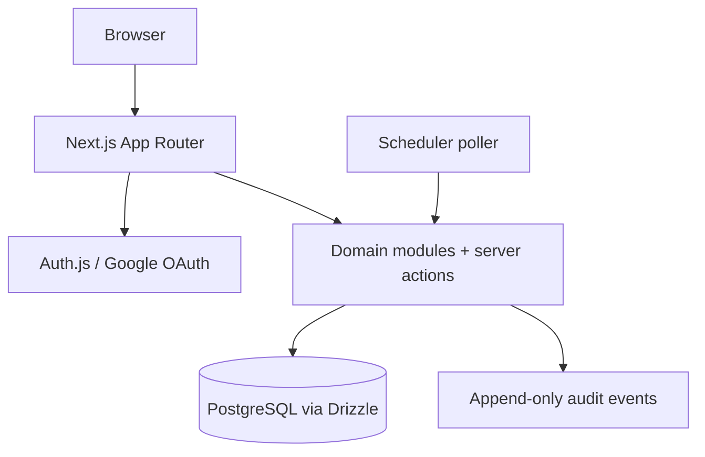

# Current Architecture

**Status:** Current implementation baseline, with future recommendations clearly
marked. This document describes the repository as it exists today; the longer
trade-off discussion remains in [architecture-history.md](architecture-history.md).

## Runtime shape

The application is a modular monolith. The Next.js process serves the UI,
server actions, and route handlers. Domain modules perform authorization,
validation, persistence, and audit writes against PostgreSQL.

## Technology baseline

| Concern | Current repository choice | Evidence |
|---|---|---|
| Web framework | Next.js App Router, React, TypeScript | `package.json`, `src/app/` |
| Persistence | PostgreSQL | `docker-compose.yml`, `src/db/` |
| Data access | Drizzle ORM and SQL migrations | `drizzle.config.ts`, `drizzle/`, `src/db/schema/` |
| Authentication | Auth.js Google provider; local dev-login provider | `src/auth.ts`, `src/app/signin/page.tsx` |
| Validation | Zod and service-level validation | `src/env.ts`, `src/modules/forms/`, tests |
| Background work | Reconciliation poller | `src/modules/scheduling/`, `scripts/scheduler.ts` |
| Development | Docker Compose | `docker-compose.yml` |
| Tests | Vitest unit/integration projects | `vitest.config.ts`, `tests/` |

There is no `pg-boss` dependency in the current repository. The poller is the
current scheduling mechanism; adding a queue is a future optimization, not a
prerequisite for the web-app UI.

## Module boundaries

| Module | Responsibility | Main paths |
|---|---|---|
| Auth and identity | Sign-in, users, email normalization, roster-email resolution | `src/auth.ts`, `src/modules/identity/`, `src/db/schema/identity.ts` |
| Authorization | Deny-by-default, resource-scoped checks | `src/modules/authz/` |
| Catalog | Courses, sections, staff, enrollments, topics | `src/modules/catalog/`, `src/db/schema/catalog.ts` |
| Forms | Templates, questions, cycles, submissions, validation | `src/modules/forms/`, `src/db/schema/forms.ts` |
| Review | Submission review, validity, private replies | `src/modules/review/` |
| Publishing | Public answer drafts, source links, publication | `src/modules/publishing/`, `src/db/schema/publishing.ts` |
| Backlog/import | Backlog records and roster/legacy import foundations | `src/modules/backlog/`, `src/modules/roster-import/` |
| Scheduling | Cycle reconciliation and due publication | `src/modules/scheduling/`, `scripts/scheduler.ts` |
| Audit | Append-only audit writes | `src/modules/audit/`, `src/db/schema/audit.ts` |

## Route surface

The current route inventory is maintained in [CURRENT_STATE.md](CURRENT_STATE.md).
Routes are intentionally thin: they load data, enforce access, and call domain
services. Business rules should not be duplicated in React components.

| Surface | Current responsibility |
|---|---|
| `/signin` | Google sign-in and local-only dev login |
| `/` | Role-aware dashboard and section links |
| `/sections/[id]` | Current student weekly form and submit action |
| `/sections/[id]/history` | Student submission history |
| `/sections/[id]/qa` | Section-scoped Q&A archive |
| `/teach/sections/[id]/review` | Staff review, validity, private/public response actions |
| `/teach/sections/[id]/roster` | Staff class list: imported students and UP-email link status (no approve/reject) |
| `/teach/sections/[id]/import` | Forwards to the class list — the import is a modal there |
| `/api/auth/[...nextauth]` | Auth.js callback route |
| `/api/internal/scheduler/tick` | Secret-protected scheduler tick |

## Data and consistency invariants

- `form_responses` has a unique `(cycle_id, student_record_id)` constraint.
- Form questions are owned by either a template version or a cycle snapshot,
  never both.
- Template edits create new versions; generated cycles retain their snapshot.
- Participation is derived from valid form responses, not a mutable counter.
- Public answers contain reworded text and internal source links; the public
  record contains no asker identity.
- Scheduled publication is state-guarded and retry-safe; failures remain
  visible for staff recovery.
- Roster re-import deactivates missing enrollments rather than deleting them.
- Important mutations write audit events in the same transaction where feasible.

## Security boundaries

- Google domain restrictions are configuration-driven.
- Student access requires the account's normalized UP email to be on a class list, plus an active enrollment.
- Staff access requires course/section membership and, for TAs, an explicit
  permission flag.
- Platform-admin status does not grant automatic content access.
- Public Q&A access is section-scoped, despite the word “public.”
- Server-side authorization is authoritative; hiding a link is not a security
  control.

See [SECURITY.md](SECURITY.md) for the threat model and release checklist.

Durable architecture choices are recorded in
[decisions/](decisions/). Deployment and release assumptions are in
[DEPLOYMENT.md](DEPLOYMENT.md).

## Architecture decisions for the first UI build

1. Keep the modular monolith and existing domain services.
2. Build the UI around the current services instead of introducing a second API
   layer solely for the first visual pass.
3. Keep scheduling as a poller while volume and operational evidence are small.
4. Add a queue only if reconciliation latency, retry visibility, or workload
   volume demonstrates a real need.
5. The TypeScript stack is the **settled** baseline — D1 closed 2026-08-03 and
   no F#/Fable option is planned
   ([ADR-0001](decisions/ADR-0001-current-stack-and-scheduler.md)). The
   alternatives that were weighed, and why each was rejected, are recorded in
   [architecture-history.md](architecture-history.md).

## Future boundaries

The following may be added later without changing the core domain model:

- richer course/section setup UI;
- a dedicated background-job abstraction;
- LMS integration;
- AI-assisted drafting behind explicit human approval and PII controls.

Do not add these while building the first web-app slice unless scope is
explicitly expanded.

**Email notifications are no longer a future boundary.** `F1` was approved and
built: an idempotent outbox with SMTP/fake/log adapters and reconciliation,
sending for form-opened, deadline reminders and validity changes. Enqueue paths
for private-answer, public-answer-linked and approval events exist but their
triggering workflows are **not wired**. See
[CURRENT_STATE.md](CURRENT_STATE.md) `F1`.
