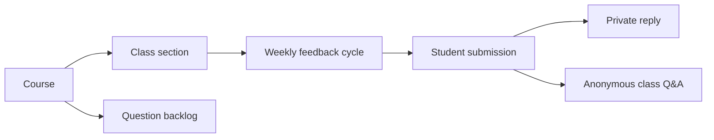

# Project Overview

## Product

Class Feedback is a university-only workflow for recurring class feedback. It
replaces the manual work that follows Google Forms collection: reading every
response, deciding what to answer, compiling answers into a separate document,
tracking participation, and searching past questions.

The product is deliberately closer to a calm academic operations workspace than
to a social network. Students should be able to speak honestly without
revealing their identity to classmates, while teachers should have enough
context and tooling to respond responsibly.

## Core academic model

- A **course** owns reusable templates, topics, and the question backlog.
- A **class section** owns its roster, staff, recurrence schedule, cycles,
  responses, participation, and Q&A archive.
- A **weekly cycle** is one scheduled instance of a section's form.
- A **student submission** contains answers to teacher-created questions and an
  optional student-originated item.
- A **public answer** is section-scoped and anonymous to students; it is not
  public to the internet.

## Primary workflows

### Student loop

1. Sign in with an allowed university Google account.
2. Their classes appear immediately: the account resolves to the class-list row
   whose UP email equals its normalized email, exactly. Nothing is claimed,
   matched by name, or confirmed by a teacher — an account whose address is on
   no class list is told only that (decision **D23**,
   [student-identity.md](student-identity.md)).
3. Open the current cycle for an enrolled section.
4. Answer required questions and optionally submit a question or feedback item.
5. Save a draft, submit, and keep editing that same response until the deadline;
   at the deadline the latest submitted version locks. No late submission, no
   late edit, and an edit never mints a second participation credit.
6. Return to history to see private replies and whether an item was answered.
7. Search the section's anonymous Q&A archive.

### Staff loop

1. Create or select a course and class section.
2. Import and reconcile the roster.
3. Check the class list linked every student's UP email, and configure section staff.
4. Create a reusable template and recurring weekly schedule.
5. Review incoming submissions in an inbox.
6. Mark validity, send private replies, or draft/reword/publish public answers.
7. Move suitable items to the course backlog or merge related questions.
8. Monitor participation and export staff-only CSV reports.

## Product success signals

These are proposed measurements, not current requirements:

- A student can complete a weekly cycle without teacher assistance.
- A teacher can review a batch of responses without opening a spreadsheet.
- A published answer can be traced internally to its source without exposing the
  source student to classmates.
- Participation export agrees with the valid-submission rule.
- A teacher can recover from a missed scheduler run without duplicate cycles or
  duplicate publications.
- Students can find prior answers without relying on a separate document.

## Scope boundary

The detailed scope is owned by [mvp-scope.md](mvp-scope.md). The current
implementation is a foundation slice, not the complete product; see
[CURRENT_STATE.md](CURRENT_STATE.md).

## Privacy posture

The most important UX promise is not merely “anonymous.” The interface must
explain what is anonymous to classmates, what staff can see, and why a teacher
may need to reword a highly specific question before publishing it. See
[SECURITY.md](SECURITY.md) and [public-qa-and-source-linking.md](public-qa-and-source-linking.md).
